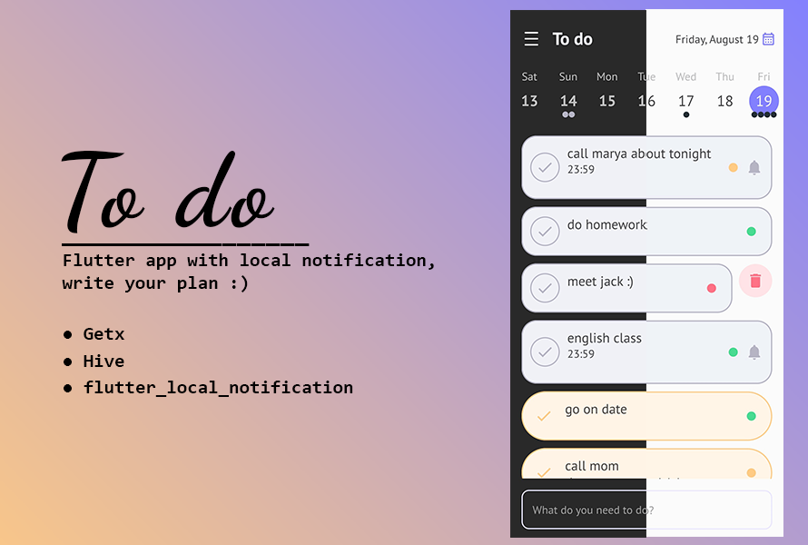

<h1 align="center">


To do

<!-- 

 -->

</h1>

Simple todo app with notification
with `GetX` and `Hive` and pushing notification with `flutter_local_notifications`.

 
### Ui adapted from [Rita Deyneko](https://dribbble.com/shots/5084136-DailyUi-042-ToDo-List)


### Packages used in project :
- [flutter_local_notifications](https://pub.dev/packages/flutter_local_notifications)
- [flutter_svg](https://pub.dev/packages/flutter_svg)
- [hive_flutter](https://pub.dev/packages/hive_flutter)
- [intl](https://pub.dev/packages/intl)
- [loading_animation_widget](https://pub.dev/packages/loading_animation_widget)
- [path_provider](https://pub.dev/packages/path_provider)
- [table_calendar](https://pub.dev/packages/table_calendar)
- [timezone](https://pub.dev/packages/timezone)
- [google_fonts](https://pub.dev/packages/google_fonts)
- [http](https://pub.dev/packages/http)


### How to use:
1. run `flutter pub get` to get packages
2. run `flutter packages pub run build_runner build`
> flutter

### Folder Structure (lib) :
```
├───main.dart
├───controller
│   ├───event_controller.dart
│   ├───hive_initializer.dart
│   └───theme_controller.dart
├───model
│   ├───color_adapter.dart
│   ├───event_model.dart
│   └───event_model.g.dart
├───service
│   └───notification_service.dart
└───view
    ├───home
    │   ├───home_screen.dart
    │   └───widgets
    │        ├───bottomsheet
    │        ├───events_listtile
    │        ├───home_appbar
    │        │   ├───home_drawer
    │        │   └───appbar_row.dart
    │        └───table_calendar
    ├───event
    │   ├───event_screen.dart
    │   ├───edit_event_screen.dart
    │   └───widgets
    │        ├───utils.dart
    │        ├───event_sections
    │        ├───selectors_widget
    │        └───textformfields
    │            ├───home_drawer
    │            └───appbar_row.dart
    ├───splash
    │   └───splash_screen.dart
    └───utils
         ├───calendar_theme.dart.dart
         ├───colors.dart
         └───theme.dart
```
- Controller : contains getx controllers
    - theme_controller: where save darkmode and light and loads
    - event_controller: core of app, load event, save, delete and ...
    - hive_initializer: initing boxes - this function passed in `main()`
- Model : this folder contains eventmodel where we can define our events and its eventadapter - colors_adapter for hive for saving colors in box
- Service : all services will be apear here - notifications service
- View : all pages and widgets and themes are here
    - splash : first page when apps open
    - home : the home_screen, where we can seee calendar and events - it has widget like drawer and sections are seprated almost
    - event : event_screen allow you to create events and add reminder for yourself - all event sections are in event_sections folder like alarms & reminder, save button..
    - utils : this folder contains tablecalendar theme - colors and ThemeData
### What have done in this project :
- [x] init getx
- [x] theme controller - convert to darkmode
- [x] save events on hive
- [x] notification service
- [x] event edit page
- [ ] compatible version for ios
- [ ] add done button and share button in edit event
- [x] implement motivation quote to drawer
- [ ] add recycle bin page on drawer 
- [ ] multie language 
- [ ] implement tags and search on tags 
- [ ] calendar show events on first load (tablecalendar bug)


